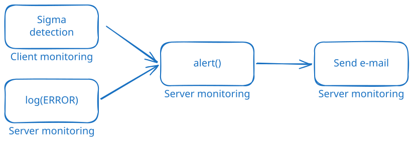

Velociraptor does a lot in the background. Client and server event
queries run continuously. Hunts and scheduled flows complete on their
own time. Detection artifacts watch for IoCs. Most of this happens
without anyone looking. And when someone does, they may find that
the event query they relied on for uploading data to S3 has failed
for over a week. Or that flows in the last hunt have started
failing. Or that the collection scheduled for the CEO's laptop —
which was offline at the time — has finally completed, with results
that should have been inspected immediately.

This post introduces a small family of exchange artifacts that
notify you when any of this happens:

- [`Server.Monitor.FlowCompletion`](/exchange/artifacts/pages/server.monitor.flowcompletion/):
  sends an e-mail when a client flow completes (or fails)
- [`Server.Monitor.Alerts`](/exchange/artifacts/pages/server.monitor.alerts/):
  forwards alerts created by `alert()` calls anywhere in the
  deployment
- [`Server.Monitor.Errors.Alert`](/exchange/artifacts/pages/server.monitor.errors.alert/)
  and
  [`Server.Monitor.Client.Errors.Alert`](/exchange/artifacts/pages/server.monitor.client.errors.alert/):
  turn entries in the monitoring log into alerts so failures stop
  being silent

Each artifact has a dedicated knowledge-base guide with the full
parameter reference and recipes.

## Overview

There are many ways to send a notification (Slack, Teams, PagerDuty
etc.), but this series sticks to e-mail because:

- it requires little setup and works almost everywhere
- it can carry a lot of information per message

Two of the artifacts introduced here send e-mail directly:

- [`Server.Monitor.FlowCompletion`](/exchange/artifacts/pages/server.monitor.flowcompletion/)
- [`Server.Monitor.Alerts`](/exchange/artifacts/pages/server.monitor.alerts/)

The remaining artifacts, and most of the examples, produce alerts.
If you want alerting but not e-mail notifications, the error
monitoring and the use of `alert()` for detection are still
relevant — only the final hop changes.



### Sending e-mails

Every e-mail produced by the artifacts in this post passes through
two pieces of shared infrastructure:

- **An SMTP secret** holds the connection details (server, port,
  credentials, sender address). It is created once in **Manage
  Server Secrets** and referenced by name everywhere else.
- [`Generic.Utils.SendEmail`](/artifact_references/pages/generic.utils.sendemail/)
  builds a properly-encoded MIME message: it Base64-wraps the body,
  supports `multipart/alternative` for HTML with plain-text fallback,
  and handles file attachments. It then calls the underlying
  [`mail()`](/vql_reference/other/mail/) function for you.


If you have not configured SMTP yet, start with
[How to send e-mails from Velociraptor](/knowledge_base/tips/sending_email/).
It also covers testing locally with
[Mailpit](https://mailpit.axllent.org/), which lets you send as
many e-mails as you want without getting blocked by any real SMTP
server, and explains the
[global e-mail throttling](/knowledge_base/tips/sending_email/#throttling)
worth knowing about before going to production.

## Flow-completion notifications

`Server.Monitor.FlowCompletion` watches `System.Flow.Completion` and
sends an e-mail when a client flow finishes. The default e-mail
includes client details, flow metadata (creator, timestamps,
duration, requested artifacts, arguments), and a result summary.


It is deliberately filter-heavy. Out of the box you would be flooded
with notifications, so the artifact ships with sensible defaults
(ignore `Generic.Client.Info`, ignore hunts, only notify on flows
that took longer than 10 seconds) and a long list of knobs to tune
the rest:

- `ArtifactsToAlertOn`/`ArtifactsToIgnore`: regex match on the
  collected artifacts
- `ClientLabelsToAlertOn`/`ClientLabelsToIgnore`: match on client
  labels
- `ArtifactPermToAlertOn`: only notify when the collected artifacts
  require a specific permission, e.g. `EXECVE`
- `DelayThreshold`: only notify when the flow took at least N
  seconds (filters out clients that were already online)
- `ErrorHandling`: multi-choice flag that lets failures bypass
  individual filters (`IncludeHunts`, `IgnoreArtifactFilters`,
  `IgnoreDelay`)
- `NotifyIfResultsLabels`/`NotifyIfUploadsLabels`: special
  override. If a client carries this label, any flow that produces
  results (or uploads) notifies regardless of other filters

Recipients can come from a fixed list (`Recipients`), be derived
from the user who scheduled the flow (`NotifyExecutor`, optionally
mapping bare usernames to full addresses), or be pulled from a
client metadata field (`NotifyMetadataEMail`). All three can be used
at once.

###### A few examples

- **Notify the analyst who ran a collection**: Set `NotifyExecutor`
  to true. If usernames are e-mail addresses, that is all you need;
  otherwise add `NotifyExecutorDomains` to map them. Since getting
  a notification for a flow that finishes immediately is not very
  useful, set `DelayThreshold` to a few seconds or minutes.
- **Audit shell access**: Set `ArtifactPermToAlertOn` to `EXECVE`
  and `DelayThreshold` to `0`. Every completed flow that involved a
  shell artifact lands in the auditor's mailbox.
- **Notify the device owner**: Store the owner's address in a
  client metadata field and point `NotifyMetadataEMail` at that
  field. Useful in environments with strict privacy rules.
- **Catch only failures in a hunt**: Leave `NotifyHunts` off, but
  add `IncludeHunts` to `ErrorHandling`. Be sure to test-run your
  hunts first, before enabling this.

###### Including results in the e-mail

`IncludeResultTableFrom` renders selected sources as inline HTML
tables. `IncludeResultAttachmentFrom` exports them as JSONL or CSV
attachments. Both accept a CSV of `Source`, `Columns`, `MaxRows`
(and `CellLimit`), so you can keep the output narrow and predictable
even when an artifact returns dozens of columns.


See
[How to set up e-mail notifications for flow completions](/knowledge_base/tips/email_alerts/)
for more information.

## Detection alerts

Flow-completion notifications fire on every flow that passes the
filters, regardless of what the flow actually found. Alerts are
different: the artifact author chooses when to surface something
worth attention, such as when a honeyfile is accessed, a YARA rule
matches, or a network connection hits an IoC list. The
[`alert()`](/vql_reference/other/alert/) function is how that
signal is sent. Each call pushes a record onto
`Server.Internal.Alerts`, a deployment-wide queue that any server
event artifact can subscribe to.

```vql
SELECT alert(
    name="Honeyfile accessed",
    dedup=300,
    Path=FileName,
    `Process name`=ProcessName,
    `Process info`=ProcInfo,
    PID=Pid
)
FROM ...
```

The `name` argument is required. Everything else is free-form
context that travels with the alert. Identical names are
deduplicated for two hours by default; pass `dedup=-1` to disable
the suppression while testing.

Although `alert()` can be used in VQL anywhere, it makes the most
sense to use it in event artifacts. Collections and hunts finish or
expire, after which you would normally inspect the results. Event
queries never stop, making alerts a good way to notify when
something noteworthy happens.

`Server.Monitor.Alerts` is the consumer. It watches the
`Server.Internal.Alerts` queue, formats each alert as an HTML or
plain-text e-mail, and sends it through the same
`Generic.Utils.SendEmail` utility as `Server.Monitor.FlowCompletion`.


As seen in the screenshot above, the resulting e-mail contains a
lot of details. Every free-form argument passed to `alert()` is
included as alert context and flattened by default. This makes
nested JSON data a lot more readable. The client and flow
information may be optionally disabled.

### Where to call `alert()`

There are two ways to alert on detections in client monitoring:
directly in the client event artifact, or in a server event
artifact watching the client event artifact.

The simplest place is inside the artifact that detects the
condition. If you do not want to modify the existing artifact, or
want full control over when the alert fires and with what context,
create a small server event artifact:

###### Server monitoring for client honeyfile access

```yaml
name: Server.Monitor.HoneyfileAccess
type: SERVER_EVENT
sources:
  - query: |
      SELECT alert(
          name=format(
            format='Honeyfile "%v" accessed on %v',
            args=(FileName,
                  client_info(client_id=ClientId).os_info.hostname)),
          ClientId=ClientId,
          Artifact="Linux.Detection.Honeyfiles",
          ArtifactType="CLIENT_EVENT",
          Severity="high",
          `File name`=FileName,
          PID=Pid,
          `Process name`=ProcessName)
      FROM watch_monitoring(artifact="Linux.Detection.Honeyfiles")
```

See [Using alerts in Velociraptor](/knowledge_base/tips/vql_alerts/)
for details.

## Catching silent failures

Event queries fail. Perhaps not during testing, but after months
of successfully calling an API or parsing events from an endpoint.
A `parse_json()` call quietly fails, returning nothing. An
`upload_S3()` call exhausts its retries. A `watch_ebpf()` regex
fails to compile. `execve()` is denied by client config. None of
these stops the event query from running; they all just write
something to the monitoring log. You would have to study these
logs (per client in the case of client monitoring) in order to
notice the errors.


`Server.Monitor.Errors.Alert` (server) and
`Server.Monitor.Client.Errors.Alert` (clients) periodically inspect
those logs and call `alert()` for entries that match their filters.
Combined with `Server.Monitor.Alerts`, you can get an e-mail notification every
time a monitoring artifact starts failing.

The filter model is shared by both: `IncludeFilter` and
`ExcludeFilter` are CSVs with regex columns for `Artifact`, `Level`
and `Message`, plus an optional `Severity` column and any extra
columns you add for free-form context (such as a description of the
error). Rows match top-to-bottom and the first match wins, so put
specific patterns above broad catch-alls.

```csv
Artifact,Level,Message,Severity,Explanation
.+,DEFAULT,fork/exec .+ no such file or directory,high,Executable not found
.+,DEFAULT,upload_S3: operation error .+,high,S3 upload failed with no retry
.+,ERROR,.+,medium,
```

A subtle point worth knowing: many errors from native VQL functions
and plugins are logged at level `DEFAULT`, not `ERROR`. A naive
filter that only matches `ERROR` will miss most of them. The
[reference list of known VQL DEFAULT-level errors](/knowledge_base/tips/vql_error_catalogue/)
collects regex rows for uploads (S3, Splunk, Elastic, GCS, Azure,
SFTP, SMB, WebDAV), parsing (`parse_json`, `parse_csv`,
`parse_yaml`, MFT/USN), Sigma/YARA, hunts, eBPF, ETW, and more —
copy what you need into `IncludeFilter` and adjust severities to
taste. The artifacts ship with a deliberately conservative default
(just `ERROR.+`) because whether each `DEFAULT`-level entry is
fatal depends on how the function or plugin is used by the
artifact producing it.

`Server.Monitor.Client.Errors.Alert` iterates over **all** clients
to query their per-client monitoring logs. The work is parallelised,
but it is still more expensive than the server-side variant —
narrow `IncludeFilter` to the artifacts you actually care about
before turning it on in a large deployment.

See
[How to monitor event artifact errors](/knowledge_base/tips/monitoring_artifact_errors/)
for a full walkthrough.

## Summary

If you want to try out all of the discussed monitoring:

1. Create an SMTP secret of type **SMTP Creds** and grant access to
   `VelociraptorServer (Server Event Runner)`.
2. Add `Server.Monitor.FlowCompletion` as a server event artifact.
   Start with `NotifyExecutor=true` and a sensible `DelayThreshold`,
   then refine `ArtifactsToAlertOn`/`ArtifactsToIgnore` and the
   label filters as you go.
3. Add `Server.Monitor.Alerts` so anything that calls `alert()`
   (detection artifacts, error monitors, your own custom watchers)
   produces an e-mail. Configure `SeverityTransforms` and
   `SeverityThreshold` as needed.
4. Add `Server.Monitor.Errors.Alert` to surface failures in your
   server event queries.
5. Optionally add `Server.Monitor.Client.Errors.Alert`, scoped to the
   handful of client event artifacts you feel the need to monitor
   closely for errors.
6. Set `SendInterval` to `-1` once the configuration is settled. The
   default 10-second window silently drops bursts. This is useful
   while tuning, but could be problematic in production when you
   expect to be alerted.

## Further reading

- [How to send e-mails from Velociraptor](/knowledge_base/tips/sending_email/):
  SMTP secrets, `mail()`, `Generic.Utils.SendEmail`, Mailpit
- [How to set up e-mail notifications for flow completions](/knowledge_base/tips/email_alerts/):
  `Server.Monitor.FlowCompletion` in depth
- [Using alerts in Velociraptor](/knowledge_base/tips/vql_alerts/):
  `alert()`, severity, deduplication, custom watchers
- [How to monitor event artifact errors](/knowledge_base/tips/monitoring_artifact_errors/):
  `Server.Monitor.Errors.Alert` and the client variant
